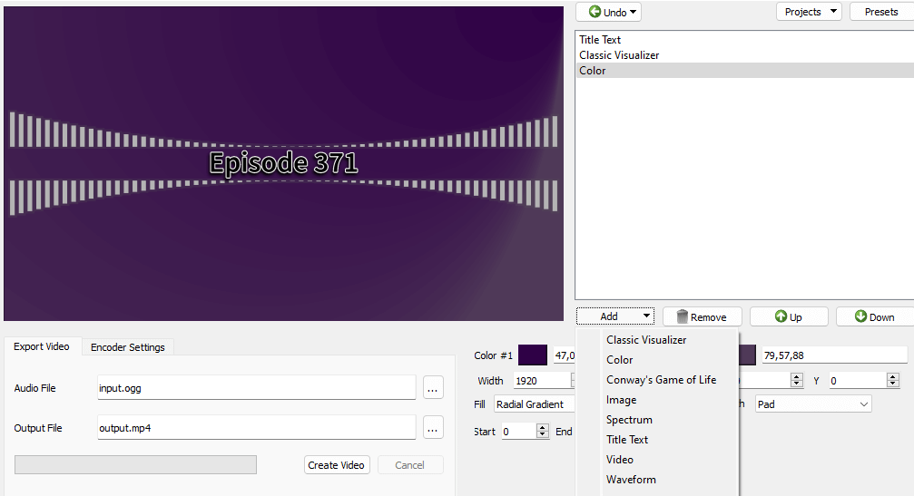

# Audio Visualizer Python
**We need a good name that is not as generic as "audio-visualizer-python"!**

This is a little GUI tool which creates an audio visualization video from an input audio file. Different components can be added and layered to change the resulting video and add images, videos, gradients, text, etc. Encoding options can be changed with a variety of different output containers.

The program works on **Linux**, **macOS**, and **Windows**. If you encounter problems running it or have other bug reports or features that you wish to see implemented, please fork the project and submit a pull request and/or file an [issue](/issues) on this project.


# Screenshots & Videos
[](/screenshot.png?raw=true)

## A video created by this app
* **[YouTube: A day in spring](https://www.youtube.com/watch?v=-M3jR1NuJHM)** 🎥

## Video demonstration of the app features
* [YouTube: Audio Visualizer Python v2.0.0 demonstration](https://www.youtube.com/watch?v=EVt2ckQs1Yg) 🎥


# Installation
## Installation on Ubuntu 22.04
* Install dependencies: `sudo apt install ffmpeg python3-pip python3-pyqt5`
    * You may wish to install the app within an isolated Python environment so it doesn't affect other Python packages on your system. You can do this easily using [Pipx](https://pypi.org/project/pipx/): replace `python3-pip` with `pipx` in the apt command above, then use `pipx` instead of `pip` to automatially install Python apps in isolated environments.
* Download this repo and run `pip install .` in this directory (or use `pipx` for isolation)
* Run the program with `avp` from terminal
* Or try double-clicking the graphical shortcut ("run" or "execute" the file if asked)


## Installation on Windows
* Install Python from the Windows Store
* Add Python to your system PATH (it should ask during the installation process)
* Download this repo (extract from zip if needed)
* Download and install [FFmpeg](https://www.ffmpeg.org/download.html). Use the GPL-licensed static builds.
* Add FFmpeg to the system PATH as well (program will then work anywhere)
  * Alternatively, copy ffmpeg.exe into the folder that you want to run the program within
* Open command prompt, `cd` into the repo directory, and run: `pip install .`
* Now run `avp` or `python -m avp` from a command prompt window to start the app


## Manual installation on macOS
* **[Outdated]**: No one has updated these instructions for a while.
* Install [Homebrew](http://brew.sh/)
* Use the following commands to install the needed dependencies:
```
brew install python3
brew install ffmpeg --with-fdk-aac --with-ffplay --with-freetype --with-libass --with-libquvi --with-libvorbis --with-libvpx --with-opus --with-x265
brew install qt
brew install sip --with-python3
brew install pyqt --with-python3
pip3 install --upgrade pip
```
* Download this repository and install it using Pip: `pip3 install .` (or use `pipx` for isolation)
* Start the app with `avp` or `python3 -m avp`


# Commandline Mode
Projects can be created with the GUI then loaded from the commandline for easy automation of video production. Some components have commandline options for extra customization, and you can save "presets" with settings to load if the commandline option doesn't exist.

## Example commands
* Create a video with a grey "classic visualizer", background image, and text:
    * `avp -c 0 image path=src/tests/data/test.jpg -c 1 classic color=180,180,180 -c 2 text "title=Episode 371" -i src/tests/data/test.ogg -o output.mp4`
* Create projects and presets from commandline and add changed elements onto them:
    * `avp my-podcast-project -c 99 text "title=Episode 371" preset=PodcastText -i input.ogg -o output.mp4`
* Get more commandline options for Classic Visualizer component:
    * `avp -c 0 classic help`
    _(component names are "fuzzy searched" so many names will work)_
* See more commandline options: `avp --help`
* Run program in debug mode: `avp --debug`
  * Debugging log files are in the app's config directory (`.config` or `AppData/Local`)


# Keyboard Shortcuts
| Key Combo                 | Effect                                             |
| ------------------------- | -------------------------------------------------- |
| Ctrl+S                    | Save Current Project                               |
| Ctrl+A                    | Save Project As...                                 |
| Ctrl+O                    | Open Project                                       |
| Ctrl+N                    | New Project (prompts to save current project)      |
| Ctrl+Z                    | Undo                                               |
| Ctrl+Shift+Z _or_ Ctrl+Y  | Redo                                               |
| Ctrl+T _or_ Insert        | Add Component                                      |
| Ctrl+R _or_ Delete        | Remove Component                                   |
| Ctrl+Space                | Focus Component List                               |
| Ctrl+Shift+S              | Save Component Preset                              |
| Ctrl+Shift+C              | Remove Preset from Component                       |
| Ctrl+Up                   | Move Selected Component Up                         |
| Ctrl+Down                 | Move Selected Component Down                       |
| Ctrl+Home                 | Move Selected Component to Top                     |
| Ctrl+End                  | Move Selected Component to Bottom                  |
| Ctrl+Shift+U              | Open Undo History                                  |
| Ctrl+Shift+F              | Show FFmpeg Command                                |
| Ctrl+Alt+Shift+R          | Force redraw preview (must use `--debug`)          |
| Ctrl+Alt+Shift+A          | Dump MainWindow data into log (must use `--debug`) |


# Developer Information
## Known Working Versions of Dependencies
* Python 3.10
* FFmpeg 4.4.1
* PyQt5 (Qt v5.15.3)
* Pillow 9.1.0
* NumPy 1.22.3

## Getting Faster Export Times
* [Pillow-SIMD](https://github.com/uploadcare/pillow-simd) may be used as a drop-in replacement for Pillow if you desire faster video export times, but it must be compiled from source. For help installing dependencies to compile Pillow-SIMD, see the [Pillow installation guide](https://pillow.readthedocs.io/en/stable/installation.html). Then add the `-SIMD` suffix into `setup.py` and install as usual.

## Developing a New Component
* Information for developing a component is in our wiki: [How a Component Works](https://github.com/djfun/audio-visualizer-python/wiki/How-a-Component-Works)
* File an issue on GitHub if you need help fitting your visualizer into our component system; we would be happy to collaborate


# License
Source code of audio-visualizer-python is licensed under the MIT license.

Some dependencies of this application are under the GPL license. When packaged with these dependencies, audio-visualizer-python may also be under the terms of this GPL license.
